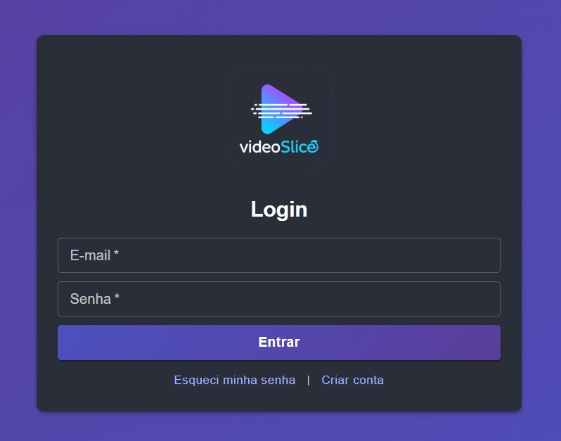
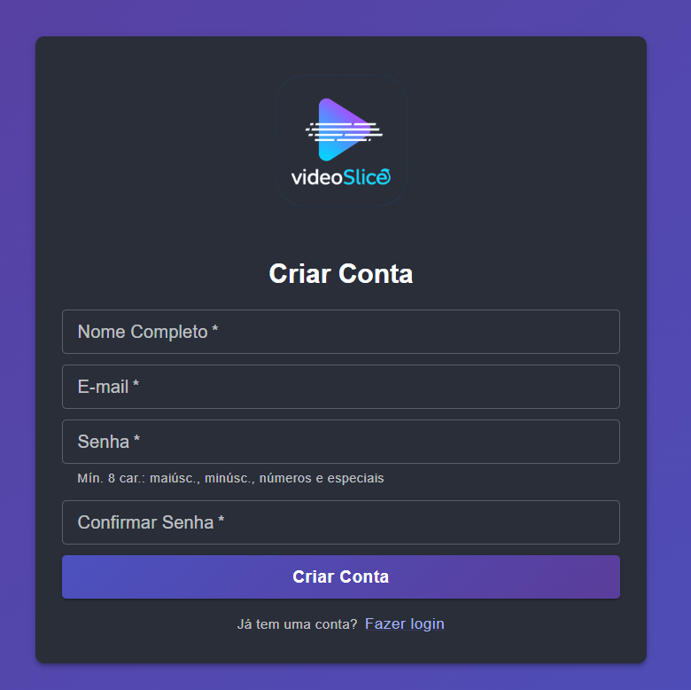
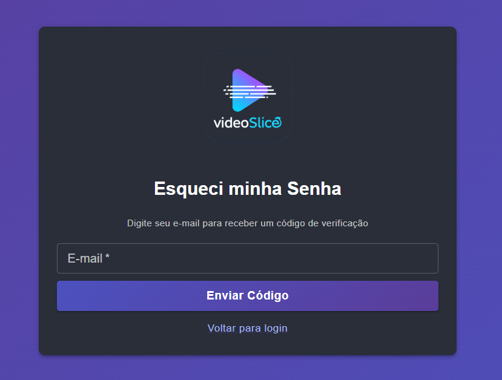
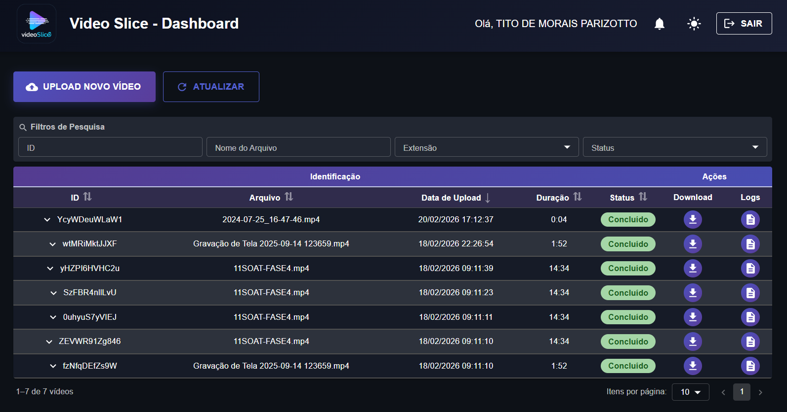
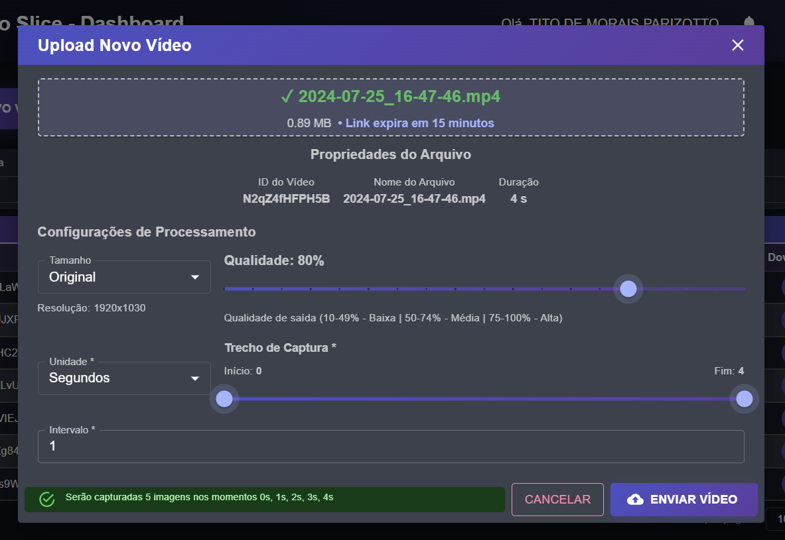
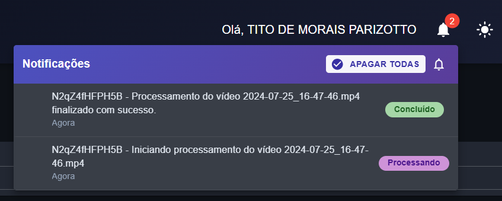

# Portal Web Video Slice

[](https://github.com/11soat-hackathon-videoslice/fe-video-slice/actions/workflows/build_test_deploy_amplify.yaml)

## Índice

- [Descrição](#descrição)
- [Funcionalidades](#funcionalidades)
- [Ambientes](#ambientes)
- [Tecnologias](#tecnologias)
- [Como executar localmente](#como-executar-localmente)
- [Como executar o build](#como-executar-o-build)

## Descrição

Frontend do sistema **Video Slice**, desenvolvido em React. A aplicação permite que usuários façam upload de vídeos, acompanhem o status do processamento e realizem o download dos frames extraídos em formato `.zip`.

### Funcionalidades

- Autenticação de usuários via AWS Cognito (Login, cadastro e recuperação de senha)
- Upload de vídeos para processamento
- Listagem e acompanhamento do status dos vídeos enviados
- Download dos frames extraídos (`.zip`)
- Notificações em tempo real via AWS AppSync (GraphQL Subscriptions)
- Suporte a modo claro e escuro

## Ambientes

| Ambiente   | URL |
|------------|-----|
| Develop    | https://develop.d3do9xqqovmquq.amplifyapp.com/ |
| Produção   | https://master.d3do9xqqovmquq.amplifyapp.com/ |

## Tecnologias

- [React](https://reactjs.org/)
- [AWS Amplify](https://aws.amplify.com/)
- [AWS Cognito](https://aws.amazon.com/cognito/)
- [AWS AppSync](https://aws.amazon.com/appsync/)
- [Material UI (MUI)](https://mui.com/)

## Como executar localmente

```bash
npm install
npm start
```

## Como executar o build

```bash
npm run build
```

## Screenshots

<table>
  <tr>
    <td align="center"><b>Login</b><br/></td>
    <td align="center"><b>Cadastro</b><br/></td>
  </tr>
  <tr>
    <td align="center"><b>Esqueci a Senha</b><br/></td>
    <td align="center"><b>Dashboard</b><br/></td>
  </tr>
  <tr>
    <td align="center"><b>Upload</b><br/></td>
    <td align="center"><b>Notificações</b><br/></td>
  </tr>
</table>

## Nota sobre Avaliação

> ⚠️ O frontend **não é um requisito de avaliação** do projeto. Por este motivo, não foram adicionados testes unitários nem configuração de quality gate (SonarQube) para este módulo.
